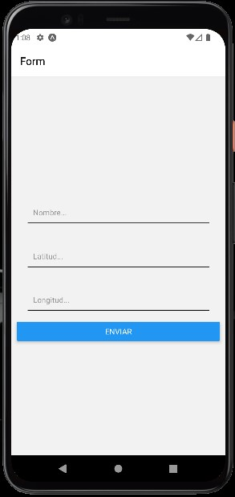
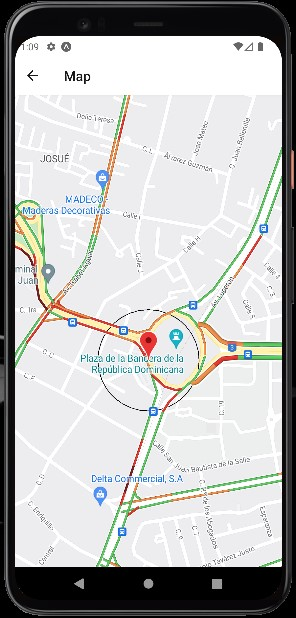

# Map app
This app was build using React Native.

## Setup
#### Step 1: clone repo
`https://github.com/dluismendezpy/maps-app.git`

#### Step 2: install dependencies
`npm i`

#### Step 3: open an emulator or a physical device
`npm start` or `yarn start`

## examples

